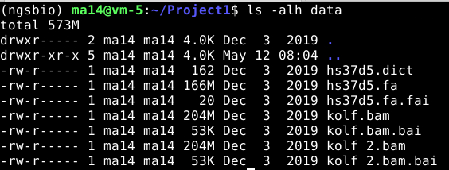
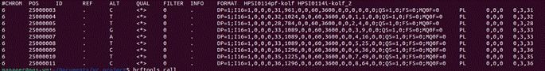
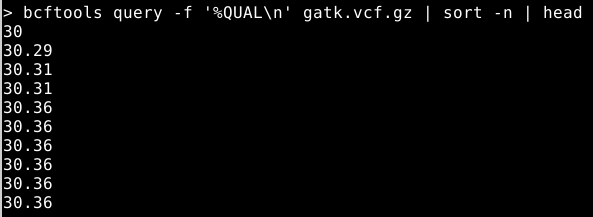
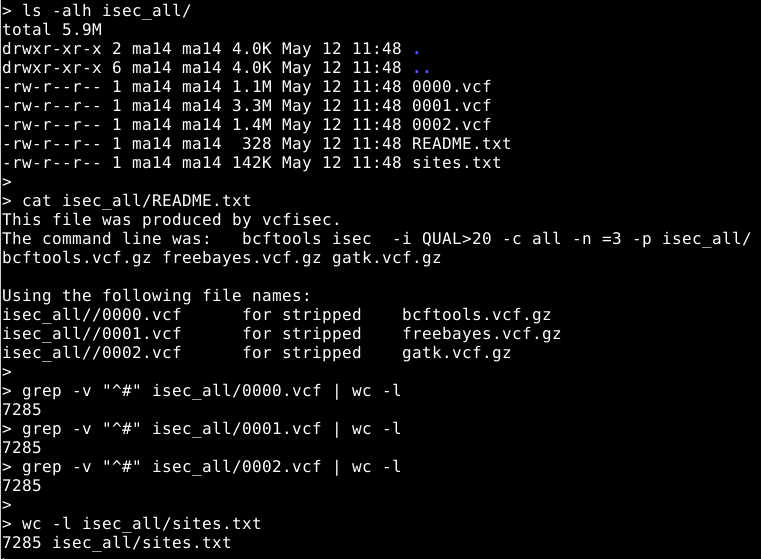

# Project 1: Comparison of variant callers

In this project you will compare three widely used variant callers: BCFtools, FreeBayes and GATK using a 50 Mb region from human chr6.

You will

Run the three variant callers on the same dataset
Compare the number of SNPs and indels identified
Assess callset quality using transition/transversion (ts/tv) ratios
Compare raw and filtered callsets
Identify shared and private variants using bcftools isec
Interpret how filtering and caller choice affect variant discovery
Data download
You will use two iPS cell lineages kolf and kolf_2 from the HipSci project. Download a tarball with the scripts https://tinyurl.com/y3srttso and unpack and prepare the data as follows

| # Create project directory and change to it mkdir $HOME/Project1 && cd "$_"  # Download and extract the files wget -O variant-calling-comparison.tgz https://tinyurl.com/y3srttso tar xvfz variant-calling-comparison.tgz  rm variant-calling-comparison.tgz |
|---|

Let us look into the data
Inside the folder you will have the reference fasta file (.fa) with its corresponding index (.fai) and dictionary (.dict) files. And two bam files with their index file (.bai)
Variant calling tools to be used
bcftools mpileup
freebayes
GATK HaplotypeCaller
All the tools should be installed. Otherwise run “./download.sh conda” step.
Tasks
Task 1: Run the three variant callers (should take 20 - 25min):

| bcftools mpileup -r 6 -f data/hs37d5.fa data/kolf.bam data/kolf_2.bam -Ou | bcftools call -mv -Oz -o bcftools.vcf.gz  freebayes -r 6 -f data/hs37d5.fa data/kolf.bam data/kolf_2.bam | bcftools view -Oz -o freebayes.vcf.gz  java -Xms4g -Xmx4g -jar bin.part/gatk.jar HaplotypeCaller -R data/hs37d5.fa -I data/kolf.bam -I data/kolf_2.bam -L 6 -O /dev/stdout | bcftools view -Oz -o gatk.vcf.gz |
|---|

Explanations for bcftools: The code “bcftools mpileup” outputs values for all positions (similar to gvcf) – see below.
Therefore, we pipe the output to “bcftools call” to extract only the variants.
bcftools mpileup used command line information

| Flag | Explanation |
|---|---|
| -r --regions | Region to be used. Format that you can use: Chromosome number (eg: 1 or chr1, depend on how your fasta or  bam file looks like) Chr:pos (eg: chr1:37832 or 1:37832) Chr:start-end (eg: chr1:37832-40000 or 1:37832-40000) Chr:start- (eg: chr1:37832- or 1:37832-) *means start from chr1 at 37832 pos and the rest) |
| -f --fasta-ref | The reference fasta file (unzip or bgzip)    Must be indexed (.fai extension) |
| -Ou | -O refer to Output type. The u refers to uncompressed |

bcftools call used command line information

| Flag | Explanation |
|---|---|
| -m --multiallelic-caller | An alternative model for multialleleic and rare-variant calling method |
| -v --variant-only | To keep the variant only for the output file  |

Explanations for bcftools: The output of freebayes is an uncompressed vcf files. So we pipe the output to “bcftools view” to generate the compressed vcf file.
Explanations for gatk:

| Flag | Explanation |
|---|---|
| HaplotypeCaller | One of the modules in the gatk |
| -R --reference | Reference file |
| -I --input | Bam/sam/cram file |
| -L --intervals | The region you can specify (eg: 1 or 1:200-300) |
| -O --output | Output file where the results should be written. The “/dev/stdout” means print to terminal rather than saving to a file. |

Task 2: Create stats for the raw callsets, note the number of SNPs, indels, and ts/tv ratio.

| FILE=bcftools.vcf.gz bcftools query -f'%POS \n' -i 'type="SNP"'   $FILE | wc -l bcftools query -f'%POS \n' -i 'type="indel"' $FILE | wc -l bcftools stats $FILE | grep TSTV | cut -f5  FILE=freebayes.vcf.gz bcftools query -f'%POS \n' -i 'type="SNP"'   $FILE | wc -l bcftools query -f'%POS \n' -i 'type="indel"' $FILE | wc -l bcftools stats $FILE | grep TSTV | cut -f5  FILE=gatk.vcf.gz bcftools query -f'%POS \n' -i 'type="SNP"'   $FILE | wc -l bcftools query -f'%POS \n' -i 'type="indel"' $FILE | wc -l bcftools stats $FILE | grep TSTV | cut -f5 |
|---|

| Unfiltered VCF | # SNPs | # indels | TS/TV |
|---|---|---|---|
| bcftools | 20,862 | 1,811 | 1.88 |
| freebayes | 11,034 | 778 | 1.49 |
| gatk | 8,384 | 948 | 2.14 |

Task 3: Filter the calls, require QUAL>20 and note the number of SNPs, indels and ts/tv of the filtered callset. Can you explain the differences, especially the GATK tool?

| FILE=bcftools.vcf.gz bcftools query -f'%POS\n' -i 'type="SNP"   && QUAL > 20'  $FILE | wc -l bcftools query -f'%POS\n' -i 'type="indel" && QUAL > 20'  $FILE | wc -l bcftools stats -i'QUAL>20' $FILE | grep TSTV | cut -f5  FILE=freebayes.vcf.gz bcftools query -f'%POS\n' -i 'type="SNP"   && QUAL > 20'  $FILE | wc -l bcftools query -f'%POS\n' -i 'type="indel" && QUAL > 20'  $FILE | wc -l bcftools stats -i'QUAL>20' $FILE | grep TSTV | cut -f5  FILE=gatk.vcf.gz bcftools query -f'%POS\n' -i 'type="SNP"   && QUAL > 20'  $FILE | wc -l bcftools query -f'%POS\n' -i 'type="indel" && QUAL > 20'  $FILE | wc -l bcftools stats -i'QUAL>20' $FILE | grep TSTV | cut -f5 |
|---|

| Filtered VCF | # SNPs | # indels | TS/TV |
|---|---|---|---|
| bcftools | 9.684 | 1,054 | 2.17 |
| freebayes | 7,571 | 635 | 2.27 |
| gatk | 8,384 | 948 | 2.14 |

The number of SNPs and indels reduces and TS/TV ratio improves with QUAL>20 indicating a higher quality filtered whole-genome calls.
GATK outputs are unchanged because it already filters for QUAL ≥ 30 by default. You can fact check this via GATK HaplotypeCaller documentation or check the VCF directly:
Task 4: Use the command bcftools isec on the to find variants with QUAL>20 called by all three tools (presumably the highest-confidence calls). Explore the output. What is the ts/tv of variants in the intersection?

| # Index the VCF callsets bcftools index bcftools.vcf.gz bcftools index freebayes.vcf.gz bcftools index gatk.vcf.gz  # Filtered variants that is called by all three tools bcftools isec -i 'QUAL>20' -c all -n =3 bcftools.vcf.gz freebayes.vcf.gz gatk.vcf.gz -p isec_all/  # Calculate the TS/TV ratio  bcftools stats isec_all/0000.vcf | grep TSTV | cut -f5 bcftools stats isec_all/0001.vcf | grep TSTV | cut -f5 bcftools stats isec_all/0002.vcf | grep TSTV | cut -f5 |
|---|

The TS/TV ratios are between 2.25 - 2.29.
Explanation:
The flag -c (collapse) is how to match variants across files. -c all says match any variant at the same POS regardless of ALT alleles
The flag -n (number of files) says which variants to output based on how many files they appear in. -n =3 means exactly in 3 files (i.e. all callers)
Looking inside isec_all/ shows three vcf files which have the exact same number of variants inside each file.
Task 5: The variants called by one program only (presumably enriched for errors). What is the ts/tv of variants private to the callers?

| # Filtered variants that is called by all three tools bcftools isec -i 'QUAL>20' -c all -n =1 bcftools.vcf.gz freebayes.vcf.gz gatk.vcf.gz -p isec_private/  cat isec_private/README.txt  # This file was produced by vcfisec. # The command line was:	bcftools isec  -i QUAL>20 -c all -n =1 -p  # isec_private/ bcftools.vcf.gz freebayes.vcf.gz gatk.vcf.gz #  # Using the following file names: # isec_private//0000.vcf	for stripped	bcftools.vcf.gz # isec_private//0001.vcf	for stripped	freebayes.vcf.gz # isec_private//0002.vcf	for stripped	gatk.vcf.gz  # Calculate the TS/TV ratio  bcftools stats isec_private/0000.vcf | grep TSTV | cut -f5 bcftools stats isec_private/0001.vcf | grep TSTV | cut -f5 bcftools stats isec_private/0002.vcf | grep TSTV | cut -f5 |
|---|

The values for the variants private to each callers are 2.12 (bcftools), 2.01 (freebayes) and 1.66 (GATK).
Explanation:  -n =1 means exactly in 1 file (i.e. private to one of the caller)